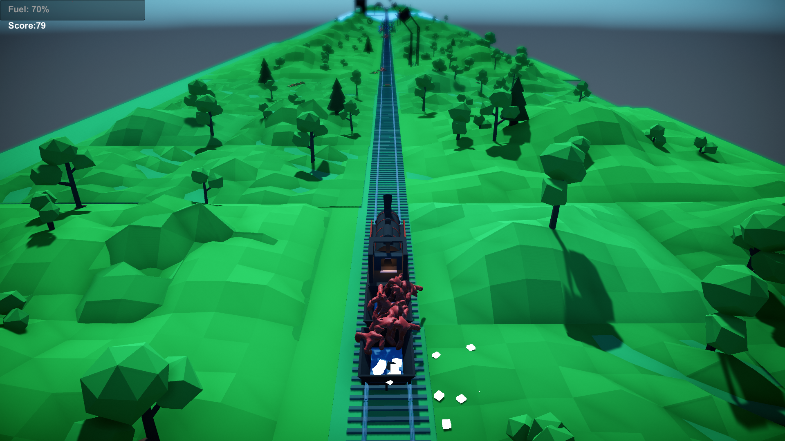
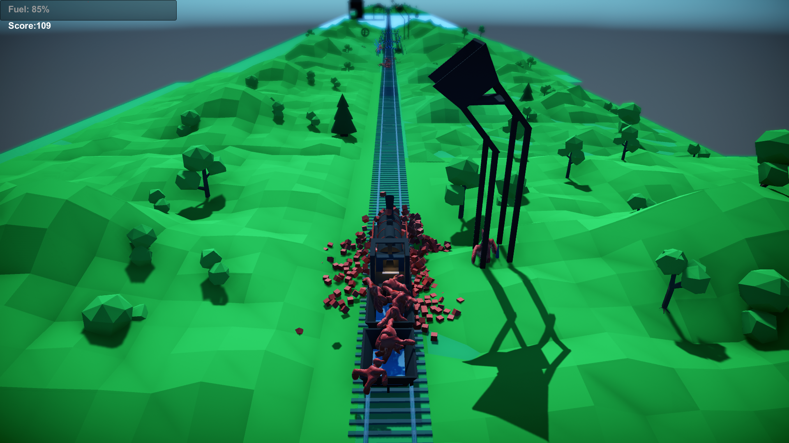
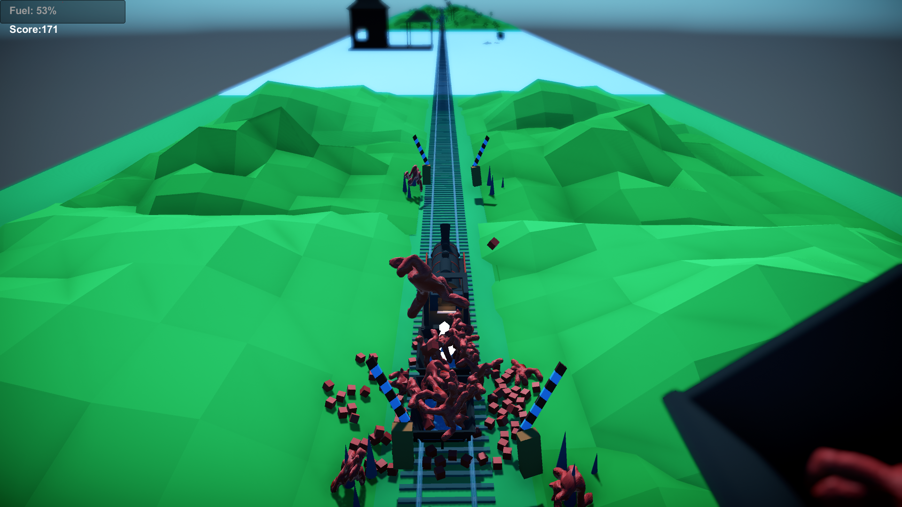

# Murdertrain-A-Comin
[Ludum Dare 43](https://ldjam.com/events/ludum-dare/43/murdertrain). Theme: "Sacrifices must be made". Arcade, puzzle, road rage

Genre: arcade, puzzle, road rage
Choo-choo! Murdertrain a comin’ for ya! To grab you by the invisible hand, put you in a cart and use you for it’s unknown evil purposes! smiling_imp

Player’s main objective is to get as far as possible. The game is infinite - see how far do you get. The fuel is limited and the only source of it is actually the passengers. Pick them up with the mouse and put them in cart to use later. See a cart staying alone in the field? Don’t hesitate - take it and attach to your (murder)train! Low on fuel? Take one dude and throw it in train’s furnace - it will heat it up a little. Watch out for dangerous traps that blocks your way! Roadblocks can be opened with a little bit of human sacrifice - just throw one of the dudes on spikes! Mines… Well, should I still tell you how to disarm them?

A little sweet project will show you that any problem can be solved when enough manpower is thrown at it. Literally!!

#### How to play
 * *Spacebar* - attack
 * *W* - jump
 * *S* - roll

#### Team
 * [Grimani](https://ldjam.com/users/grimani)
 * [Makerart](https://ldjam.com/users/makerart)
 * [Long-as-Python](https://ldjam.com/users/long-as-python)
 * [Team-on](https://ldjam.com/users/team-on)
 
#### Screenshots
 
 
 

#### Gameplay video
[Link](https://www.youtube.com/watch?v=YLNo_HohK5Y)
